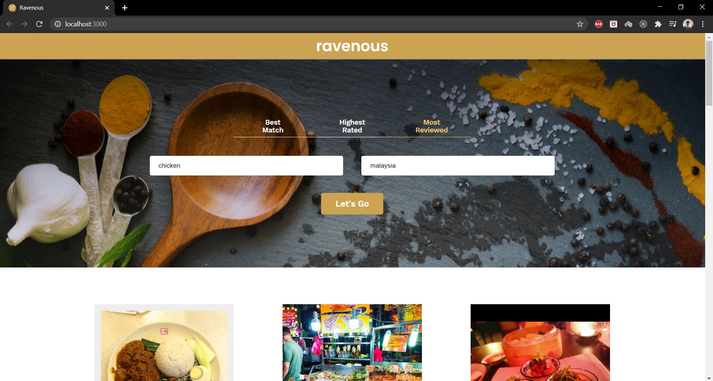

# Ravenous App

## Description

A web app for searching restaurants/businesses based on location. And can filter the search based on best match, highest rated and most reviewed. Data was fethed from Yelp API.

## Table of Contents

* [Description](#description)
* [Technologies](#technologies)
* [Instructions](#instructions)

## Technologies

### Languages

* HTML5
* CSS3
* Javascript
* JSX

### Framework / Libraries

* React

### Deployment

* Surge.sh

### Other technologies

* VSCode
* Git
* GitHub

## Instructions

Must request temporary access to the demo server before using the web app

* [Go to this link](https://cors-anywhere.herokuapp.com/corsdemo)
* Click button 'Request temporary access to the demo server'
* [Use the Ravenous web app](https://ravenous-by-amir.surge.sh)
